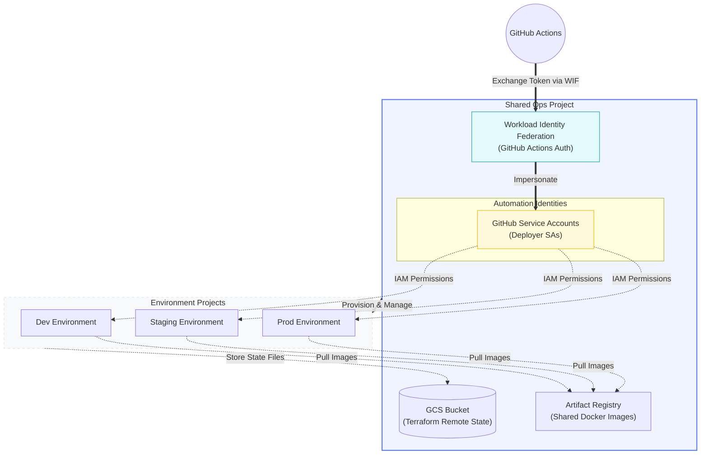
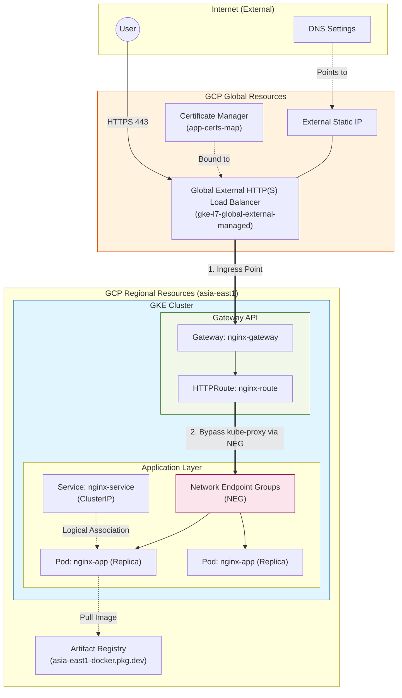
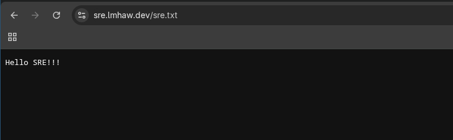
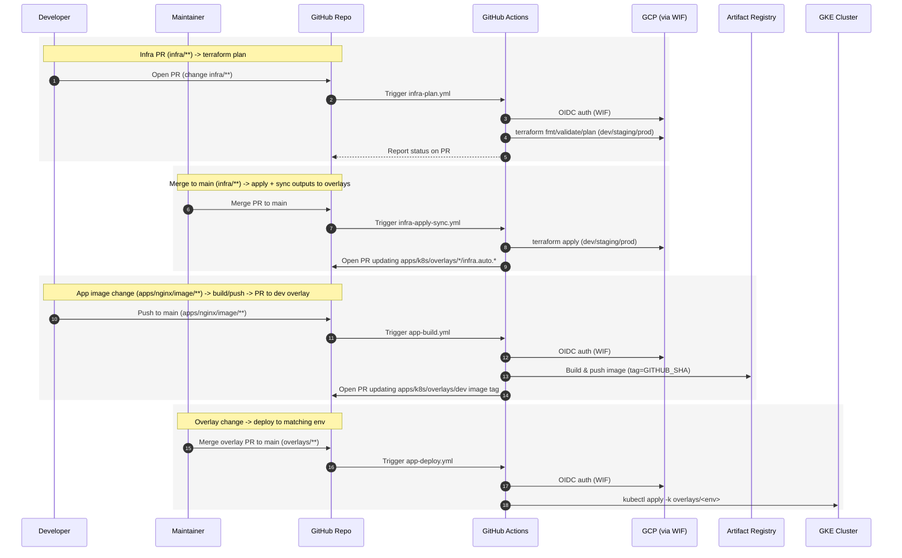

# GCP GKE GitOps Blueprint

Reference implementation for a multi-environment **GCP/GKE** delivery stack. The repository covers GKE provisioning with Terraform, container image build pipelines, Kubernetes deployment with Kustomize, and a GitHub Actions based CI/CD + GitOps workflow.

## Repo Structure

- `infra/`: Terraform configurations (GCP).
  - `infra/bootstrap/`: Initial setup for the shared ops project, Terraform remote state (GCS bucket), Artifact Registry, GitHub Actions WIF (OIDC), and required IAM roles for each environment.
  - `infra/live/{dev,staging,prod}/`: Environment-specific resources including VPC, GKE, and Certificate Manager.
  - `infra/modules/`: Reusable Terraform modules (network, app-gke, certificates, registry, github-wip, github-sa, etc.).
- `apps/nginx/image/`: Custom Nginx Docker image, including `sre.txt`.
- `apps/k8s/:` Kubernetes manifests managed via Kustomize.
  - `apps/k8s/base/:` Core resources including Deployment, Service, and Gateway API (Gateway + HTTPRoute).
  - `apps/k8s/overlays/{dev,staging,prod}/`: Multi-environment overlays (handles image tags, replica counts, and patches auto-generated from Terraform outputs).
- `.github/workflows/`: CI/CD pipelines for infra plan/apply sync, image build, and Kubernetes deployment.

## Overall Architecture
The repository utilizes GitHub Actions (WIF) to drive Terraform and Kubernetes deployments, following a Hub-and-Spoke design pattern:

- **Hub (Shared Ops Project)**: Manages centralized resources, including the Terraform remote state bucket (GCS), Artifact Registry, and Workload Identity Federation (WIF).
- **Spokes (Environment-Specific Projects)**: Dedicated projects for `dev`, `staging`, and `prod` to provision environment-specific infrastructure and host application workloads.

### Ops project
The Ops Project is responsible for:
- Terraform State: Uses a GCS bucket to store remote state, ensuring team collaboration and state consistency.
- Artifact Registry: Centralized management of Docker images, allowing consistent pulls across all environments.
- Workload Identity Federation (WIF): Enables GitHub Actions to securely exchange credentials via OIDC, eliminating the risk of storing long-lived service account keys in GitHub Secrets.

### Environment projects
Each environment project (dev/staging/prod) hosts its own GKE cluster, Certificate Manager, Cloud DNS records, and associated resources. Images are pulled from the centralized Artifact Registry in the Shared Ops Project. These projects utilize independent resources and configurations to ensure strict environment isolation and security.

## Implementation Overview
The following sections describe the main implementation areas in the repository and point to the relevant files and directories.

### Infrastructure Provisioning
Terraform source code to establish a runnable Kubernetes platform.
- `infra/bootstrap/` contains Terraform code to set up the shared ops project, including remote state bucket, Artifact Registry, and GitHub Actions WIF (OIDC) configuration (There is a [README.md](infra/bootstrap/README.md) with detailed instructions for this part)
- `infra/modules/` contains reusable Terraform modules (network, app-gke, certificates, registry, github-wip, github-sa…), which are called in each environment's `infra/live/<env>/main.tf` to create the actual resources (VPC, GKE cluster, certs, etc.)

The configuration in `infra/` is structured to support multiple environments (dev/staging/prod) with separate state files and resources, while still sharing common infrastructure patterns through modules. And is used to provision the whole infrastructure of the application / project.

### Container Image
An Nginx-based image with a `sre.txt` file containing the text `Hello SRE!`
- `apps/nginx/image/Dockerfile` build nginx image with `sre.txt` copied to nginx static directory, allowing `GET /sre.txt` to return `Hello SRE!`
- Additionally placed an `index.html` for the root path, which can be accessed via `GET /` with a link to `/sre.txt`

### Kubernetes Deployment
Deploy the Nginx image to the Kubernetes cluster and expose it through a load balancer.
- `apps/k8s/` contains Kustomize manifests to deploy nginx to GKE, including:
  - Deployment + Service (ClusterIP with NEG annotation)
  - Gateway API resources (Gateway + HTTPRoute): Which configures the GKE L7 Load Balancer to route external traffic to the nginx service.
- All necessary configurations for each environemnt are placed in `infra/live/<env>` and `apps/k8s/overlays/<env>` 

> [!IMPORTANT]
> Sites are removed and not accessible due to pricing concerns, but the configuration is still in the repo to demonstrate the multi-env setup

### CI/CD and GitOps
The workflows in `.github/workflows/` automate infrastructure and application delivery across multiple environments.

#### Infrastructure and application pipelines
- infra：
  - `infra-plan.yml`: PR plan, triggered by changes to `infra/**`, runs `terraform fmt/validate/plan` for all environments (TODO: reports status back to PR)
  - `infra-apply-sync.yml`: triggered by merges to main on `infra/**`, runs `terraform apply` for all environments, then renders outputs into Kustomize patch files and opens PRs to for k8s update if there are changes
- app：
  - `app-build.yml`: triggered by changes to `apps/nginx/image/**`, builds and pushes image to Artifact Registry, then opens PR to update dev overlay with new image tag
  - `app-deploy.yml`: triggered by changes to `apps/k8s/overlays/**`, deploys to corresponding environment

#### Promotion model
- `apps/k8s/overlays/{dev,staging,prod}/` contains environment-specific Kustomize overlays, which can be promoted via PRs to deploy to staging/prod after testing in dev

#### CI/CD + GitOps Workflow Diagram

#### multi-env promotion example
1. `app-build.yml` workflow build new image and open PR that update `apps/k8s/overlays/dev/kustomization.yaml`
2. `app-deploy.yml` deploys to dev after PR merge, test the change in dev environment
3. If everything looks good, open a PR to update `apps/k8s/overlays/{staging,prod}` with the same image tag (or new release tag) to promote the change to staging/prod

### Terraform to Kubernetes Handoff
Services and overlays need to reference resources created by Terraform.
- Use terraform outputs to generate Kustomize patch files to include resource in ther service (like what `.github/workflows/infra-apply-sync.yml` does) 

## GitHub Settings
Environment variables (for `dev`/`staging`/`prod` respectively)
- `REGISTRY_PROJECT_ID`：project id of the Artifact Registry (ops project)
- `REGISTRY_REGION`：region of the Artifact Registry 
- `REGISTRY_REPO`：name of the Artifact Registry repo
- `GCP_WORKLOAD_IDENTITY_PROVIDER`：WIF provider resource name (Obtained from `infra/bootstrap` outputs)
- `GCP_SERVICE_ACCOUNT`：Service account email for GitHub Actions to impersonate (Obtained from `infra/bootstrap` outputs)
